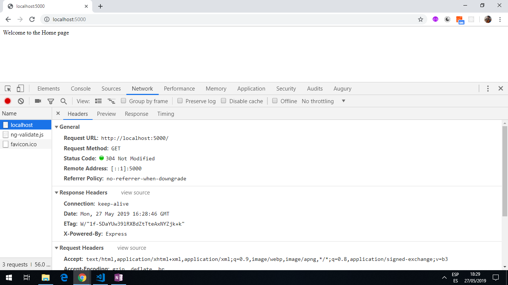
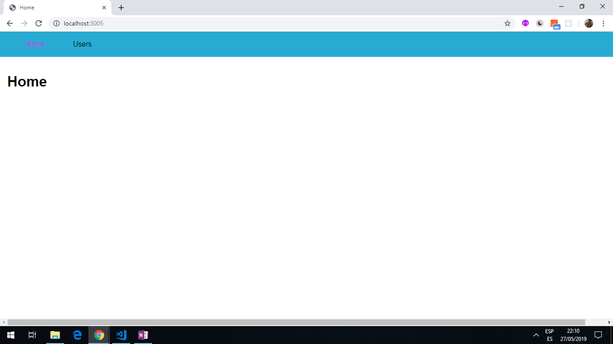

# :zap: Node.js Tutorial Notepad

* Code to learn to learn Node.js. This is part of a [Udemy NodeJS - The Complete Guide (incl. MVC, REST APIs, GraphQL)](https://www.udemy.com/nodejs-the-complete-guide/).

**Note: to open web links in a new window use: _ctrl+click on link_**

## :page_facing_up: Table of contents

* [General info](#general-info)
* [Screenshots](#screenshots)
* [Technologies](#technologies)
* [Setup](#setup)
* [Features](#features)
* [Status](#status)
* [Inspiration](#inspiration)
* [Contact](#contact)

## :books: General info

* Assignment 1 (section 3): Assignment very simple
* Assignment 2: Uses Express middleware to send text using res.send to home page ('/') and (/users) page. [link to Express documentation on app.use](http://expressjs.com/es/api.html#app.use)
* Assignment 3: Navigation
* Assignment 4: Templating engine ejs
* Section 5: Working with Express
* Section 6: HTML to Ejs, HTML to Handlebars, HTML to Pug

## :camera: Screenshots




## :signal_strength: Technologies

* [Node.js v12](https://nodejs.org)
* [Express v4](https://www.npmjs.com/package/express)
* [Embedded Javascript Templating ejs v3](https://ejs.co/) creates HTML markup with plain javascript.

* **Note:** As of Express version 4.16+, a body-parser implementation is now included in the default Express package so there is no need to download another `body-parser` dependency.

## :floppy_disk: Setup

* For all assignment/Sections: install dependencies with `npm i` then type `nodemon app.js` & open browser at `localhost:5000`.

## :computer: Code Examples

* extract from `Section6_ejs/views/add-product.ejs` showing use of ejs templating

```html
<body>
   <%- include('includes/navigation.ejs') %>

    <main>
        <form class="product-form" action="/admin/add-product" method="POST">
            <div class="form-control">
                <label for="title">Title</label>
                <input type="text" name="title" id="title">
            </div>

            <button class="btn" type="submit">Add Product</button>
        </form>
    </main>
<%- include('includes/end.ejs') %>
```

## :cool: Features

* t

## :clipboard: App Status & To-do list

* Status: Incomplete
* To-Do: comment code

## :clap: Inspiration

* [NodeJS - The Complete Guide (incl. MVC, REST APIs, GraphQL)](https://www.udemy.com/nodejs-the-complete-guide/)
* [What are the best JavaScript templating engines?](https://www.slant.co/topics/51/~best-javascript-templating-engines#26)

## :envelope: Contact

* Repo created by [ABateman](https://www.andrewbateman.org) - you are welcome to [send me a message](https://andrewbateman.org/contact)
